<!-- Please do not change this html logo with link -->

# SPI-RS485 Bridge and Modbus Client Implementation using PIC16F15276 Microcontroller

The RS485 communication with MODBUS protocol is mostly used over industrial sector for its highlighting features like balanced line communication, multi-drop facility, good noise immunity, and maximum data transmission speed. The MODBUS protocol with RS485 physical line makes transactions with multi-client easy and error free.

The serial protocol-based clients can be integrated to RS485 based host system using SPI-RS485 bridge.

The PIC16F152xx family of microcontrollers is equipped with Enhanced Universal Synchronous Asynchronous Receiver Transmitter (EUSART), Timers, and MSSP peripherals which can be used in RS485 communication and for implementation of SPI to RS485 Bridge system.

This code example highlights the integration of SPI based client sensors and communication with host through RS485 line by using SPI-RS485 Bridge. It demonstrates how to connect SPI clients to the RS485 network.

## Related Documentation

- [SPI-RS485 Bridge: Modbus Host Emulation using PIC16F15244 Microcontroller](https://github.com/microchip-pic-avr-examples/pic16f15244-spi-rs485-bridge-modbus-host-emulation-mplab-mcc.git)
- [PIC16F152xx Family Code Examples on GitHub](https://github.com/microchip-pic-avr-examples?q=pic16f152&type=&language=&sort=)
- [PIC16F152xx MCU Family Video](https://www.youtube.com/watch?v=nHLv3Th-o-s)
- [PIC16F15276 Product Page](https://www.microchip.com/en-us/product/PIC16F15276)
- [PIC16F15276 Datasheet](https://ww1.microchip.com/downloads/en/DeviceDoc/PIC16F15256-74-75-76-28-40-Pin-Microcontrollers-40002305B.pdf)

## Demo Description

The SPI-RS485 Bridge example aims to integrate serial protocol (SPI) clients to RS485 based systems.

This demonstration is having Host and Client systems. Host sends MODBUS RTU query frames to client for asking the sensor data. Client receives MODBUS frames and responds back to host with sensor data, if received frame is valid.

The host system periodically (every 10s) creates the Modbus RTU frame with client address, function code, address of the desired data, it appends the 2-bytes CRC to the frame and sends the MODBUS query frame for reading holding registers of Client.

The PIC16F15244 microcontroller acts as host and is interfaced with the RS485 2 click over EUSART and it is used to convert EUSART TTL signals to RS485 standard signals for communicating with RS485 bus network.

The client microcontroller receives the frame from host, it validates the CRC of received frame by calculating the CRC, if CRC matches, then it validates the address. Client performs the required action as per the requested function code and responds to the host by preparing the response MODBUS frame.

The client microcontroller measures the temperature using thermo click, pressure using pressure 5 click and stores it in dedicated flash memory.

The PIC16F15276 microcontroller acts as a client and interfaced with the pressure sensor on Pressure 5 click board and temperature sensor on Thermo click board over SPI. The PIC16F15276 microcontroller communicates with RS485 2 click using EUSART protocol. The RS485 2 click is used to interface the SPI sensors to RS485 bus network.

The SPI-RS485 bridge demo block diagram is shown in below figure.

  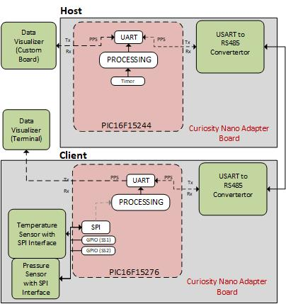
   Figure 1 : SPI-RS485 Bridge Block Diagram   

## Modbus Introduction

Modbus is a serial communication protocol developed for use with its programmable logic controllers (PLCs). In simple terms, it is a method used for transmitting information over serial lines between electronic devices. The device requesting the information is called the Modbus Host and the devices supplying information are Modbus Clients.

In a standard Modbus network, there is one Host and up to 247 Clients, each with a unique Client Address from 1 to 247. The Host can also write information to the Clients. The Host MODBUS frame includes Client address, function code, memory address, length of the expected data and CRC.

### Sample Data Frame:

Host MODBUS RTU Frame-

| Client ID | Function code	| Register address | Number of registers | CRC  |

Client Response Frame-

| Client ID | Function code	| Number of bytes data received | Register data | CRC  |

### Function Code:

The second byte sent by the Host is the Function code. This number tells the client which table to access and whether to read from or write to the table.

### Coil/Register Number:

Information is stored in the Client device in four different tables. Two tables store on/off discrete values (coils) and two store numerical values (registers). The coils and registers each have a read-only table and read-write table. Each table has 9999 values. Each coil or contact is 1 bit and assigned a data address between 0x0000 and 0x270E. Each register is 1 word = 16 bits = 2 bytes wide and it has data address between 0x0000 and 0x270E.

### Number of Registers Requested:

The total number of registers requested.

### CRC:

CRC stands for Cyclic Redundancy check. It has two bytes added to the end of every MODBUS frame for error detection and to identify the data corruption.

Example Frame:

|Request Frame Bytes | Description | Response Frame | Description |
|:---------:|:----------:|:-----------:|:---------:|:------------:|
| 0x15  | Client ID address	| 0x15 | Client ID address |
| 0x03  | Function code	| 0x03 | Function code |
| 0x00  | Address of the register requested (1st Byte)	| 0x04 | The Number of bytes data received |
| 0x6B  | Address of the register requested (2nd Byte) | 0x00 | Register value Hi (1st Byte) |
| 0x00  | The total number of registers requested (1st Byte) | 0x01 | Register value Lo (2nd Byte) |
| 0x02  | The total number of registers requested (2nd Byte) | 0xA1 | Register value Hi (3rd Byte) |
| 0xB6  | CRC for error checking (1st Byte)	| 0x9B | Register value Lo (4th Byte) |
| 0xC3  | CRC for error checking (2nd Byte) | 0xC7,0xC9 | CRC value Hi and Low (1st and 2nd Byte) |

**Note: Refer [modbus.org](https://modbus.org/) for more details on MODBUS.**

## Software Used

- [MPLAB® X IDE](http://www.microchip.com/mplab/mplab-x-ide) 6.15.0 or newer
- [MPLAB® XC8 Compiler](http://www.microchip.com/mplab/compilers) 2.41.0 or newer
- [MPLAB® Code Configurator (MCC)](https://www.microchip.com/mplab/mplab-code-configurator) 5.3.7 or newer
- [Microchip PIC16F1xxxx_DFP Device Support](https://packs.download.microchip.com/) 1.19.363 or newer pack
- TMR0 MCC Melody driver 4.0.11
- UART MCC Melody driver 1.8.0
- MSSP MCC Melody driver 6.1.7
- GPIO/Pins drivers MCC Melody driver 3.5.0

## Hardware Used

- [PIC16F15276 Curiosity Nano Board](https://www.microchip.com/en-us/development-tool/EV35F40A)
- [Curiosity Nano Base for Click Boards](https://www.microchip.com/en-us/development-tool/AC164162)
- [Thermo Click](https://www.mikroe.com/thermo-click)
- [Pressure5 Click](https://www.mikroe.com/pressure-5-click)
- [RS485 2 Click](https://www.mikroe.com/rs485-2-click)

## Hardware Setup

The PIC16F15276 Curiosity Nano (CNANO) evaluation board with the [RS485 2 Click](https://www.mikroe.com/rs485-2-click), [Thermo Click](https://www.mikroe.com/thermo-click) and [Pressure5 Click](https://www.mikroe.com/pressure-5-click) are used as client system. The CNANO and click boards are mounted on a Curiosity Nano base for Click boards. The following figure shows hardware setup of the application. Visit [SPI-RS485 Bridge: Modbus Host Emulation using PIC16F15244 Microcontroller ](https://github.com/microchip-pic-avr-examples/pic16f15244-spi-rs485-bridge-modbus-host-emulation-mplab-mcc.git) git repository for host hardware setup.

Refer hardware connection details table for more information.

  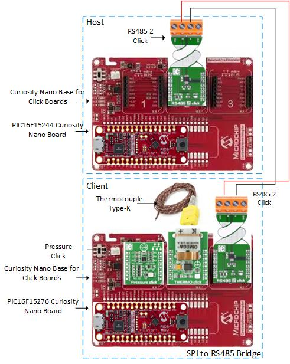
   Figure 2 : SPI-RS485 Bridge Hardware Setup   

### Hardware Connection Details

|Sl No. | Microcontroller pin | Pin Configuration | Signal name |I/O Pin Direction |
|:---------:|:----------:|:-----------:|:---------:|:------------:|
| 1     | RC2	| MOSI	 | SPI – Master Out Serial In | OUT  |
| 2     | RC5	| MISO   | SPI- Master in Serial Out | IN  |
| 3     | RC6	| SCK    | SPI – Clock | IN  |
| 4     | RC7	| IO   | Slave Select for Pressure 5 Click | OUT  |
| 5     | RA6	| IO   | Slave Select for Thermo Click | OUT  |
| 6     | RD6	| IO   | Pressure Click Interrupt | IN |
| 7     | RC0	| TX1   | TX Pin for RS485 2 Click | OUT |
| 8     | RC1	| RX1   | RX Pin for RS485 2 Click | IN |
| 9     | RB0	| TX   | CDC/Debug TX Line | OUT |
| 10    | RB1	| RX   | CDC/Debug RX Line | IN |
| 11    | RD5	| RE   | Receive Control of RS485 | OUT |
| 12    | RA7	| DE   | Transmit Control of RS485 | OUT |

Visit [SPI-RS485 Bridge: Modbus Host Emulation using PIC16F15244 Microcontroller ](https://github.com/microchip-pic-avr-examples/pic16f15244-spi-rs485-bridge-modbus-host-emulation-mplab-mcc.git) for hardware connection details of host system.

## Demo Operation

1.	Connect the hardware and prepare the demonstrator setup, follow the steps in Hardware Setup section for hardware setup.
2.	Configure the data visualizer, for viewing the custom dashboard window, follow the instructions provided in the Data Visualizer Configuration section.
3.	Click the Serial Port Control Panel Connect button.
4.	Observe “Host Modbus RTU Frame No” field (First row of the custom board) to understand which frame is sent from Host to Client.

  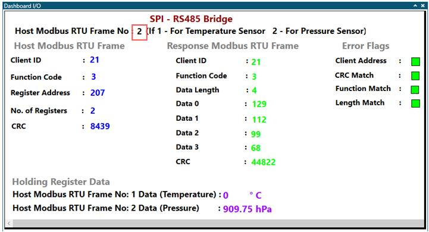
   Figure 3 : Frame type field in Data Visualizer custom dashboard window 

5.	Observe “Host Modbus RTU Frame” and “Response Modbus RTU Frame” fields to understand the Host query frame and Client response frame.

  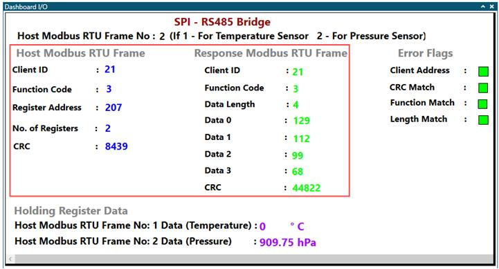
   Figure 4 : Modbus RTU frames in Data Visualizer custom dashboard window 

6.	Observe “Error Flags” fields to identify the errors when transaction is not successful.

  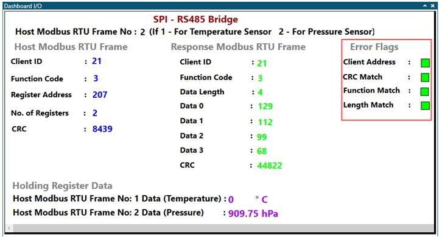
   Figure 5 : Error flags field in Data Visualizer custom dashboard window 

7.	Observe Temperature and Pressure sensor data in “Holding Register Data” fields for visualizing measured sensor data received from holding registers of client.

  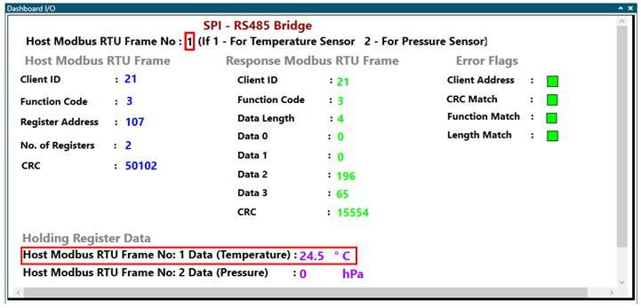
   Figure 6 : Temperature data in Holding register data field on Data Visualizer custom dashboard window 

  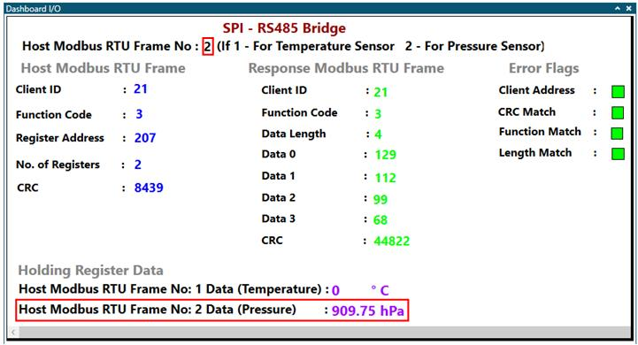
   Figure 7 : Pressure data in Holding register data field on Data Visualizer custom dashboard window 

## Steps to configure Data Visualizer

The data visualizer tool is used as a graphical user interface while demonstrating the application by displaying host frame, response received frame from Host and Client respectively. Pre-configured data streamer file and custom dashboard file are available with the Host firmware package. Follow the steps below, for data visualizer configuration using these files to prepare the setup.

### Data Visualizer Serial Port Configuration

1. Open the standalone data visualizer. Refer [Data Visualizer Software User’s Guide](https://www.microchip.com/DS40001903B) for installation and features.

  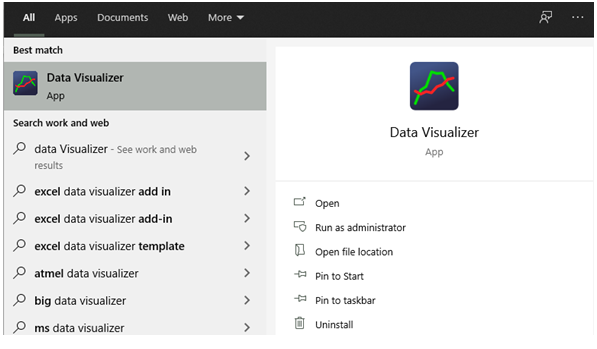
   Figure 8 : Standalone Data Visualizer icon 

2.	In the data visualizer window, click on Configuration tab.

  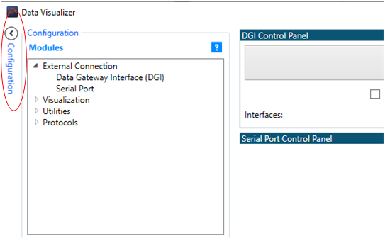
   Figure 9 : Data Visualizer Configuration Window 

3.	In the Modules section, expand External connection option and then double click on Serial port.

  
   Figure 10 : Data Visualizer Modules Window 

4.	From Serial Port Control Panel, select the Curiosity Virtual Com Port which is connected to the host device.

  
   Figure 11 : Data Visualizer Serial Control Panel 

### Data Streamer Configuration

1.	Configure the data streamer for interfacing the dashboard window with the serial port control panel.
2.	To open data stream control panel, open the Configuration tab located on the left side of the data visualizer tool, expand Protocols, and click the Data Streamer, Data Streamer window that appears, as shown in Figure 12.
3.	Click the ‘...’ symbol in the Data Stream control panel window, set an appropriate path for the provided data streamer file from the host computer, as shown in Figure 12.

  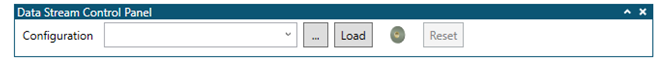
   Figure 12 : Data Visualizer Data streamer configure window 

4.	Click Load in the data streamer control panel window, as shown in Figure 12. The Data Streamer window will load with ports, as shown in Figure 13.

  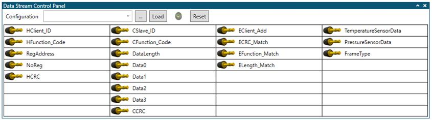
   Figure 13 : Data Visualizer Data streamer control panel 

5.	Drag COM0 output of the Serial Port control panel window and drop on to Source port of data streamer control panel window, as shown in Figure 14.

  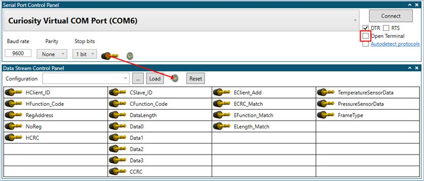
   Figure 14 : Connection between Serial Port and Data Streamer Window 

### Custom Dashboard Configuration

1.	Configure the custom dashboard window to display the battery monitoring information.
2.	To open the custom dashboard window, open the Configuration tab located on the left side of the data visualizer tool, expand Visualization, and click Custom Dashboard that appears as shown in Figure 15.

  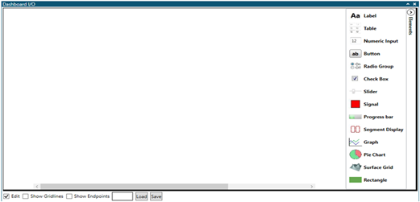
   Figure 15 : Custom Dashboard Window 

3.	Check Edit below the dashboard I/O window, click Load, and set the appropriate path for the provided custom dashboard file from the host computer, as shown in Figure 16.

  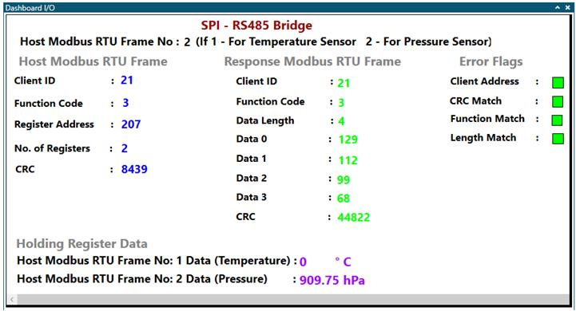
   Figure 16 : SPI-RS485 Bridge Custom Dashboard Window 

4.	Check Show Endpoints below the dashboard I/O window.
5.	Drag the appropriate port pins from the Data Streamer control panel and drop onto the respective endpoints, as shown in the Figure 17.

  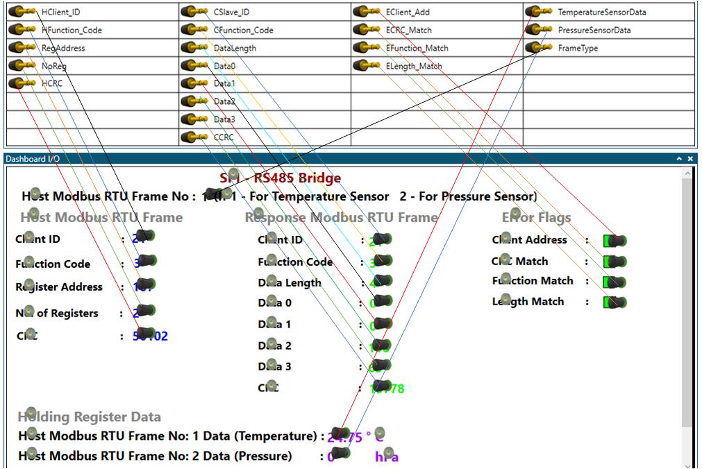
   Figure 17 : Data Visualizer Connection Reference Diagram 

6.	Follow the Data Visualizer Serial Configuration (Steps 1,2,3 and 4) steps to open the Data Visualizer terminal for Client system.

  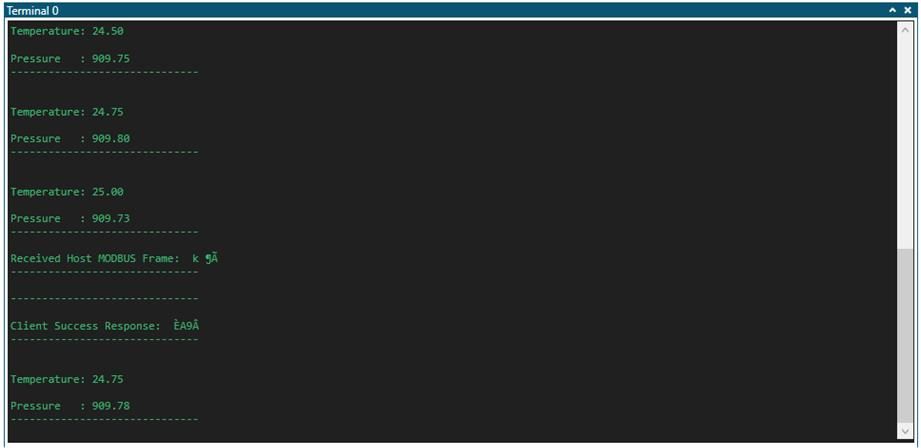
   Figure 18 : Data Visualize Terminal Window (Client) 

## Appendix

## Client MCC Configuration

### Clock Module:

- System Clock: 32MHz
- Clock Source: HFINTOSC

  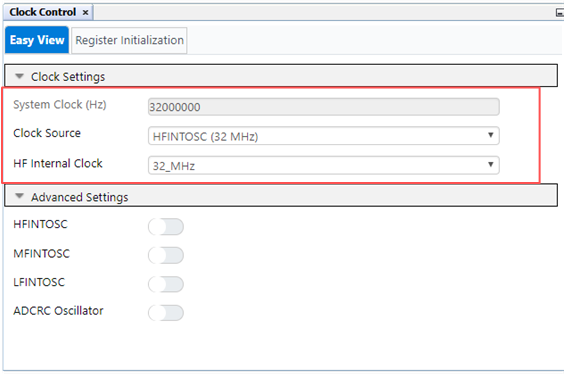
   Figure 19 : Clock Module Window 

### Configuration Bits:

- Default Value for COSC bits: HFINTOSC (32MHz)

  
   Figure 20 : Configuration Bits Window 

### EUSART:
- Baud Rate: 9600

  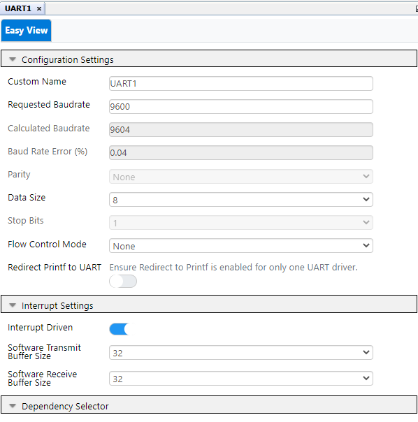
   Figure 21 : EUSART Configuration Window 

### TMR0:
- Clock Prescaler: 1:32768
- Post scaler: 1:3
- Clock Source: FOSC/4
- Requested Period(s): 3

  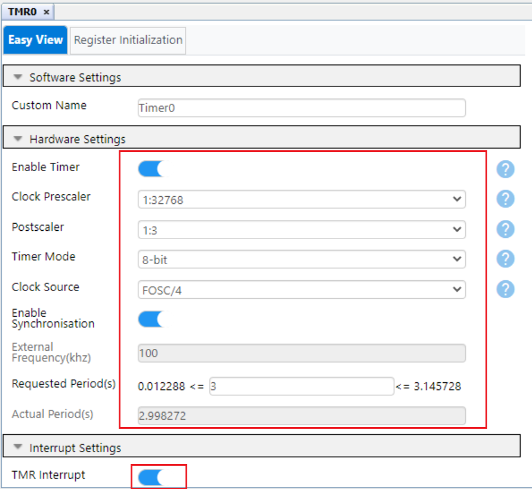
   Figure 22 : TMR0 Configuration Window 

### Pin Grid View

  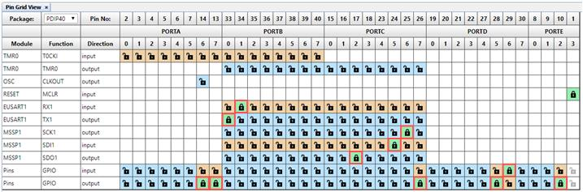
   Figure 23 : Pin Grid View Window 

### Pins

  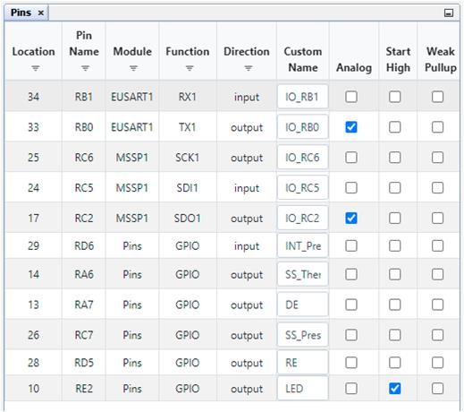
   Figure 24 : Pins Window 

